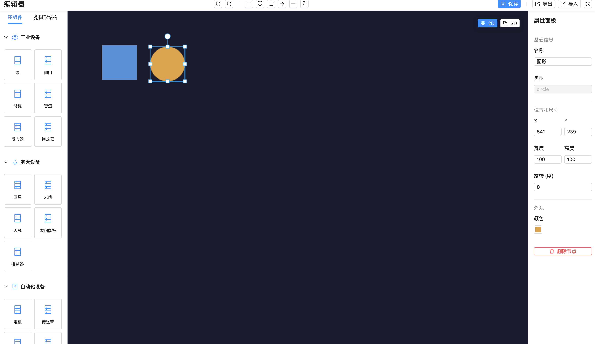
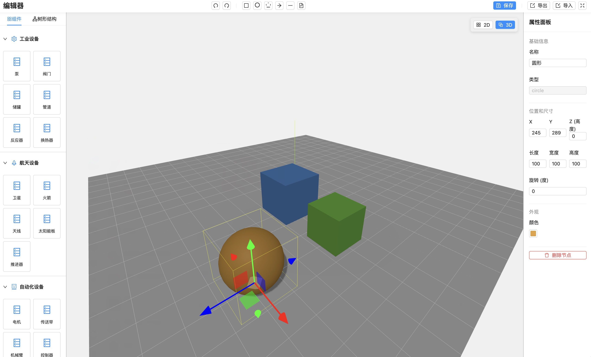

# IoTBridge 使用文档

## 目录

1. [项目概述](#项目概述)
2. [Core 核心包](#core-核心包)
   - [安装与初始化](#安装与初始化)
   - [SDK 主入口](#sdk-主入口)
   - [2D 渲染器 (Pixi2D)](#2d-渲染器-pixi2d)
   - [3D 渲染器 (Three3D)](#3d-渲染器-three3d)
   - [数据类型定义](#数据类型定义)
   - [事件系统](#事件系统)
3. [Electron Editor 桌面编辑器](#electron-editor-桌面编辑器)
   - [项目结构](#项目结构)
   - [路由配置](#路由配置)
   - [编辑器架构](#编辑器架构)
   - [EditorContext 状态管理](#editorcontext-状态管理)
4. [快捷键](#快捷键)
5. [最佳实践](#最佳实践)

---

## 项目概述

IoTBridge 是一个工业组态工具 SDK，提供 2D/3D 双模式的场景编辑能力。项目采用 Monorepo 结构，包含：

- **`packages/core`**：核心渲染 SDK，支持 PixiJS (2D) 和 Three.js (3D) 双引擎
- **`apps/electron-editor`**：基于 Electron + React + Vite 的桌面编辑器应用

### 效果预览

#### 2D 编辑模式



#### 3D 编辑模式



---

## Core 核心包

### 安装与初始化

```bash
# 在 monorepo 中，core 包作为 workspace 依赖
pnpm add core

# 或直接安装（发布后）
pnpm add industrial-sdk-core
```

### SDK 主入口

`IndustrialConfigSDK` 是核心入口类，负责管理 2D/3D 渲染器的切换和统一操作。

#### 基础用法

```typescript
import IndustrialConfigSDK from "core";
import type { SceneModel, SceneNode } from "core";

// 定义场景数据
const sceneModel: SceneModel = {
  id: "scene-1",
  version: "1.0.0",
  sceneMode: "3d", // '2d' | '3d'
  nodes: [
    {
      id: "node-1",
      type: "rect",
      transform: {
        position: { x: 0, y: 50, z: 0 },
      },
      geometry: {
        width: 100,
        height: 100,
        depth: 100,
      },
      material: {
        color: "#4A90D9",
      },
    },
  ],
  assets: {},
  symbols: [],
  meta: {},
};

// 初始化 SDK
const sdk = new IndustrialConfigSDK({
  container: document.getElementById("canvas-container")!,
  sceneModel,
  onModeChange: (mode) => {
    console.log("模式已切换到:", mode);
  },
  onSceneChange: (event) => {
    console.log("场景数据变化:", event);
  },
});
```

#### SDK 主要方法

```typescript
// ============ 场景模式 ============

// 切换渲染模式
sdk.switchSceneMode("2d"); // 切换到 2D 模式
sdk.switchSceneMode("3d"); // 切换到 3D 模式

// 获取当前模式
const mode = sdk.getSceneMode(); // '2d' | '3d'

// ============ 节点管理 ============

// 添加节点
const nodeId = sdk.addNode({
  id: "new-node",
  type: "circle",
  transform: { position: { x: 100, y: 0, z: 100 } },
  geometry: { radius: 50 },
  material: { color: "#E6A23C" },
});

// 更新节点
sdk.updateNode("node-1", {
  transform: { position: { x: 200, y: 0, z: 200 } },
  material: { color: "#F56C6C" },
});

// 删除节点
sdk.removeNode("node-1");

// 获取节点
const node = sdk.getNode("node-1");
const allNodes = sdk.getNodes();

// ============ 选择管理 ============

// 获取当前选中节点
const selectedId = sdk.getSelectedNodeId();

// 通过 ID 选中节点
sdk.selectNodeById("node-1");
sdk.selectNodeById(null); // 取消选择

// ============ 渲染器访问 ============

// 获取当前渲染器
const renderer = sdk.getRenderer();

// 获取特定渲染器
const renderer2D = sdk.get2DRenderer(); // Pixi2D | null
const renderer3D = sdk.get3DRenderer(); // Three3D | null

// ============ 视口状态 ============

// 获取/设置视口状态（用于保存/恢复视图）
const viewportState = sdk.getViewportState();
sdk.setViewportState(viewportState);

// ============ 生命周期 ============

// 销毁 SDK
sdk.dispose();
```

### 2D 渲染器 (Pixi2D)

基于 PixiJS 的 2D 渲染器，提供俯视图编辑能力。

#### 坐标系映射

```
SceneModel (3D)          Pixi2D (2D 俯视图)
position.x     →         x
position.z     →         y
position.y     →         (高度，不显示)

geometry.width  →        宽度 (X轴)
geometry.depth  →        高度 (Z轴)
geometry.height →        (Y轴高度，不显示)

rotation.y      →        旋转角度
```

#### 画布操作

```typescript
const renderer2D = sdk.get2DRenderer();
if (renderer2D) {
  // 缩放控制
  renderer2D.setZoom(1.5); // 设置缩放级别 (0.1 - 10)
  renderer2D.zoomIn(); // 放大
  renderer2D.zoomOut(); // 缩小
  renderer2D.resetZoom(); // 重置到 100%
  const zoom = renderer2D.getZoom(); // 获取当前缩放

  // 平移控制
  renderer2D.setPan(100, 100); // 设置平移位置
  renderer2D.resetPan(); // 重置平移
  const pan = renderer2D.getPan(); // 获取当前平移

  // 视图控制
  renderer2D.resetView(); // 重置视图
  renderer2D.fitToView(50); // 适应内容到视图（带边距）

  // 选择控制
  renderer2D.select(displayObject); // 选择对象
  renderer2D.deselect(); // 取消选择
  const selected = renderer2D.getSelected();

  // 变换模式
  renderer2D.setTransformMode("scale"); // 缩放模式
  renderer2D.setTransformMode("rotate"); // 旋转模式
}
```

#### 交互方式

| 操作            | 说明       |
| --------------- | ---------- |
| 鼠标滚轮        | 缩放画布   |
| 中键拖拽        | 平移画布   |
| 空格 + 左键拖拽 | 平移画布   |
| 左键点击        | 选择对象   |
| 左键拖拽对象    | 移动对象   |
| 双击对象        | 聚焦到对象 |

### 3D 渲染器 (Three3D)

基于 Three.js 的 3D 渲染器，提供完整的 3D 场景编辑能力。

#### 单位转换

```
SceneModel 像素值  →  Three.js 世界单位
100px = 1 world unit (SCALE = 0.01)
```

#### 相机控制

```typescript
const renderer3D = sdk.get3DRenderer();
if (renderer3D) {
  // 选择控制
  renderer3D.select(object3D);
  renderer3D.deselect();
  renderer3D.selectByNodeId("node-1");

  // 变换模式
  renderer3D.setTransformMode("translate"); // 移动模式
  renderer3D.setTransformMode("rotate"); // 旋转模式
  renderer3D.setTransformMode("scale"); // 缩放模式

  // 变换空间
  renderer3D.setTransformSpace("world"); // 世界坐标系
  renderer3D.setTransformSpace("local"); // 本地坐标系

  // 聚焦到对象
  renderer3D.focusOnObject(object3D);
}
```

#### 交互方式

| 操作              | 说明       |
| ----------------- | ---------- |
| 左键拖拽          | 轨道旋转   |
| 右键拖拽          | 视角旋转   |
| 中键/滚轮         | 缩放       |
| WASD              | 相机移动   |
| Q/E 或 Shift/空格 | 上下移动   |
| 方向键            | 旋转视角   |
| 左键点击          | 选择对象   |
| 双击对象          | 聚焦到对象 |

### 数据类型定义

#### SceneNode (场景节点)

```typescript
interface SceneNode {
  id: string;
  type: NodeType; // 'rect' | 'circle' | 'ellipse' | 'line' | 'polygon' | 'text' | 'group' | ...
  name?: string;
  visible?: boolean;
  locked?: boolean;
  opacity?: number;

  transform: NodeTransform;
  geometry?: NodeGeometry;
  material?: NodeMaterial;
  style?: NodeStyle;
  children?: SceneNode[];
  metadata?: Record<string, any>;
}
```

#### NodeTransform (变换)

```typescript
interface NodeTransform {
  position: { x: number; y: number; z: number };
  rotation?: { x: number; y: number; z: number }; // 角度制
  scale?: { x: number; y: number; z: number };
  anchor?: { x: number; y: number; z: number };
}
```

#### NodeGeometry (几何)

```typescript
interface NodeGeometry {
  width?: number; // X 轴尺寸
  height?: number; // Y 轴尺寸 (3D 高度)
  depth?: number; // Z 轴尺寸

  radius?: number; // 圆形半径
  radiusX?: number; // 椭圆 X 半径
  radiusY?: number; // 椭圆 Y 半径

  points?: Vec2[]; // 多边形点集
  cornerRadius?: number; // 圆角
}
```

#### NodeMaterial (材质)

```typescript
interface NodeMaterial {
  type?: "basic" | "standard" | "physical" | "phong" | "lambert" | "toon";
  color?: string;
  opacity?: number;
  metalness?: number;
  roughness?: number;
  // ... 更多 PBR 属性
}
```

#### NodeStyle (2D 样式)

```typescript
interface NodeStyle {
  fill?: string | GradientFill;
  stroke?: string;
  strokeWidth?: number;
  lineDash?: number[];

  // 文本属性
  text?: string;
  fontSize?: number;
  fontFamily?: string;
  textAlign?: "left" | "center" | "right";
}
```

### 事件系统

#### 场景变化事件

```typescript
sdk.onSceneChange((event: SceneChangeEvent) => {
  console.log("变化类型:", event.type); // 'transform' | 'add' | 'remove' | ...
  console.log("节点 ID:", event.nodeId);
  console.log("变化内容:", event.changes);
});
```

#### 选择变化事件

```typescript
// 2D 渲染器
renderer2D?.onSelectionChange((object) => {
  if (object) {
    const nodeId = (object as any).nodeId;
    console.log("选中:", nodeId);
  } else {
    console.log("取消选中");
  }
});

// 3D 渲染器
renderer3D?.onSelectionChange((object) => {
  if (object) {
    const nodeId = object.userData?.nodeId;
    console.log("选中:", nodeId);
  }
});
```

#### 变换结束事件

```typescript
renderer2D?.onTransformEnd((event) => {
  console.log("变换后位置:", event.position);
  console.log("变换后旋转:", event.rotation);
  console.log("变换后缩放:", event.scale);
});
```

---

## Electron Editor 桌面编辑器

### 项目结构

```
apps/electron-editor/
├── src/
│   ├── main/                    # Electron 主进程
│   │   ├── index.ts            # 主进程入口
│   │   ├── ipcEvent.ts         # IPC 事件处理
│   │   ├── menu.ts             # 应用菜单
│   │   └── store.ts            # 持久化存储
│   │
│   ├── preload/                 # 预加载脚本
│   │   └── index.ts
│   │
│   └── renderer/                # 渲染进程 (React)
│       └── src/
│           ├── App.tsx         # 应用入口
│           ├── router/         # 路由配置
│           ├── pages/          # 页面组件
│           │   ├── Home/       # 首页
│           │   ├── Editor/     # 编辑器
│           │   ├── Preview/    # 预览页
│           │   ├── Project/    # 项目管理
│           │   └── Settings/   # 设置页
│           ├── components/     # 公共组件
│           ├── hooks/          # 自定义 Hooks
│           ├── i18n/           # 国际化
│           └── stores/         # 状态管理
```

### 路由配置

| 路径           | 页面          | 说明          |
| -------------- | ------------- | ------------- |
| `/`            | Home          | 首页          |
| `/project`     | ProjectList   | 项目列表      |
| `/project/:id` | ProjectDetail | 项目详情      |
| `/settings`    | Settings      | 设置          |
| `/editor/:id`  | Editor        | 编辑器 (全屏) |
| `/preview/:id` | Preview       | 预览 (全屏)   |

### 编辑器架构

编辑器页面由四个核心组件组成：

```tsx
// pages/Editor/index.tsx
<EditorProvider>
  <div className={styles.editor}>
    <Header /> // 顶部工具栏
    <div className={styles.editorContent}>
      <Toolbox /> // 左侧组件库/图层树
      <Canvas /> // 中间画布
      <PropertySettings /> // 右侧属性面板
    </div>
  </div>
</EditorProvider>
```

#### Header 组件

- 撤销/重做按钮
- 基础图形工具（矩形、圆形、多边形、线条、文本等）
- 保存/导入/导出功能
- 图形支持拖拽添加到画布

#### Toolbox 组件

两个标签页：

1. **组件库** - 工业组件分类（工业设备、航空航天、自动化、传感器）
2. **图层树** - 画布节点层级结构，支持选择、删除、复制

#### Canvas 组件

- 集成 Core SDK 渲染画布
- 2D/3D 模式切换按钮
- 支持拖拽放置图形
- 节点选择同步到 EditorContext

#### PropertySettings 组件

选中节点时显示属性编辑：

- 基础信息（名称、类型）
- 位置和尺寸（X、Y、Z、宽度、高度）
- 旋转角度
- 颜色
- 文本内容（文本类型）
- 删除按钮

### EditorContext 状态管理

EditorContext 提供全局编辑器状态管理：

```typescript
interface EditorContextType {
  // SDK 实例
  sdkRef: React.MutableRefObject<IndustrialConfigSDK | null>;
  setSDK: (sdk: IndustrialConfigSDK | null) => void;

  // 选择状态
  selectedNodeId: string | null;
  selectNode: (nodeId: string | null) => void;
  getSelectedNode: () => SceneNode | null;

  // 节点操作
  addNode: (node: SceneNode) => string | null;
  updateNode: (nodeId: string, updates: Partial<SceneNode>) => boolean;
  deleteNode: (nodeId: string) => boolean;
  getNodes: () => SceneNode[];

  // 版本控制（触发重渲染）
  nodesVersion: number;

  // 渲染模式
  currentMode: "2D" | "3D";
  setCurrentMode: (mode: "2D" | "3D") => void;
}
```

#### 使用示例

```tsx
import { useEditor } from './context/EditorContext'

function MyComponent() {
  const {
    selectedNodeId,
    selectNode,
    getSelectedNode,
    addNode,
    updateNode,
    deleteNode,
    getNodes,
    currentMode,
    setCurrentMode
  } = useEditor()

  // 添加新节点
  const handleAddRect = () => {
    addNode({
      id: `node-${Date.now()}`,
      type: 'rect',
      name: '新矩形',
      transform: { position: { x: 100, y: 0, z: 100 } },
      geometry: { width: 100, height: 100, depth: 10 },
      material: { color: '#4A90D9' }
    })
  }

  // 更新选中节点颜色
  const handleColorChange = (color: string) => {
    if (selectedNodeId) {
      updateNode(selectedNodeId, {
        material: { color }
      })
    }
  }

  // 删除选中节点
  const handleDelete = () => {
    if (selectedNodeId) {
      deleteNode(selectedNodeId)
    }
  }

  return (/* ... */)
}
```

---

## 快捷键

### 2D 模式

| 快捷键                 | 功能     |
| ---------------------- | -------- |
| `2`                    | 旋转模式 |
| `3`                    | 缩放模式 |
| `Delete` / `Backspace` | 删除选中 |
| `Escape`               | 取消选择 |
| `空格` + 拖拽          | 平移画布 |
| 中键拖拽               | 平移画布 |
| 滚轮                   | 缩放画布 |

### 3D 模式

| 快捷键                 | 功能                |
| ---------------------- | ------------------- |
| `1`                    | 移动模式            |
| `2`                    | 旋转模式            |
| `3`                    | 缩放模式            |
| `X`                    | 切换世界/本地坐标系 |
| `Delete` / `Backspace` | 删除选中            |
| `Escape`               | 取消选择            |
| `W` / `S`              | 前进/后退           |
| `A` / `D`              | 左移/右移           |
| `Q` / `Shift`          | 下降                |
| `E` / `空格`           | 上升                |
| `方向键`               | 旋转视角            |
| 右键拖拽               | 旋转视角            |

---

## 最佳实践

### 1. 初始化时等待渲染器就绪

```typescript
const sdk = new IndustrialConfigSDK({
  /* ... */
});

// 2D 渲染器是异步初始化的
const renderer2D = sdk.get2DRenderer();
if (renderer2D) {
  await renderer2D.ready();
  // 现在可以安全操作渲染器
}
```

### 2. 正确处理坐标映射

```typescript
// 创建节点时使用 3D 坐标系
const node: SceneNode = {
  id: "node-1",
  type: "rect",
  transform: {
    position: {
      x: 100, // X 轴位置
      y: 50, // 高度 (2D 模式不显示)
      z: 200, // Z 轴位置 (2D 模式的 Y)
    },
  },
  geometry: {
    width: 100, // X 轴尺寸
    height: 100, // Y 轴尺寸 (高度)
    depth: 100, // Z 轴尺寸 (2D 的高度)
  },
};
```

### 3. 监听场景变化并保存

```typescript
sdk.onSceneChange((event) => {
  if (
    event.type === "transform" ||
    event.type === "add" ||
    event.type === "remove"
  ) {
    // 延迟保存，避免频繁触发
    debounce(() => {
      const data = sdk.sceneModel;
      saveToLocalStorage(data);
    }, 500);
  }
});
```

### 4. 切换模式时保持视口状态

SDK 内部自动处理视口状态的保存和恢复，切换模式时会自动保持上次该模式的视角。

```typescript
// 切换到 2D
sdk.switchSceneMode("2d");
// 再切换回 3D 时，会恢复之前的相机位置

// 也可以手动获取/设置
const viewport = sdk.getViewportState();
// viewport.viewport2D: { pan, zoom }
// viewport.viewport3D: { cameraPosition, controlsTarget, cameraZoom }
```

### 5. 组件清理

```typescript
useEffect(() => {
  const sdk = new IndustrialConfigSDK({
    /* ... */
  });

  return () => {
    // 务必在组件卸载时销毁 SDK
    sdk.dispose();
  };
}, []);
```

---

## 开发命令

```bash
# 开发模式
pnpm run dev

# 构建
pnpm run build

# 打包应用
pnpm run build:mac    # macOS
pnpm run build:win    # Windows
pnpm run build:linux  # Linux

# 类型检查
pnpm run typecheck

# 代码格式化
pnpm run format
```

---

## 支持的节点类型

| 类型       | 2D 渲染   | 3D 渲染     | 说明            |
| ---------- | --------- | ----------- | --------------- |
| `rect`     | ✅ 矩形   | ✅ 立方体   | 基础矩形/立方体 |
| `circle`   | ✅ 圆形   | ✅ 球体     | 圆形/球体       |
| `ellipse`  | ✅ 椭圆   | ✅ 椭球体   | 椭圆/椭球体     |
| `line`     | ✅ 线条   | ✅ 3D 线条  | 直线            |
| `polyline` | ✅ 折线   | ✅ 3D 折线  | 多段线          |
| `polygon`  | ✅ 多边形 | ✅ 闭合折线 | 多边形          |
| `text`     | ✅ 文本   | ❌          | 文本标签        |
| `group`    | ✅ 组     | ✅ 组       | 节点容器        |

---

## 类型导出

Core 包导出以下类型供外部使用：

```typescript
// 主要类
export { default as IndustrialConfigSDK } from "core";
export { Pixi2D } from "core";
export { Three3D } from "core";

// 类型
export type {
  SceneModel,
  SceneNode,
  NodeType,
  NodeTransform,
  NodeGeometry,
  NodeMaterial,
  NodeStyle,
  SceneMode,
  SceneChangeEvent,
  SceneChangeCallback,
  ViewportState,
  ViewportState2D,
  ViewportState3D,
  Vec2,
  Vec3,
  Vec4,
  ColorValue,
  GradientFill,
} from "core";

// 常量
export { DEFAULT_COLORS, DEFAULT_SIZES, ZOOM_LIMITS, HOTKEYS } from "core";
```

---

以上就是 IoTBridge 项目的完整使用文档。如有疑问，欢迎参考源码中的 JSDoc 注释或提交 Issue。
